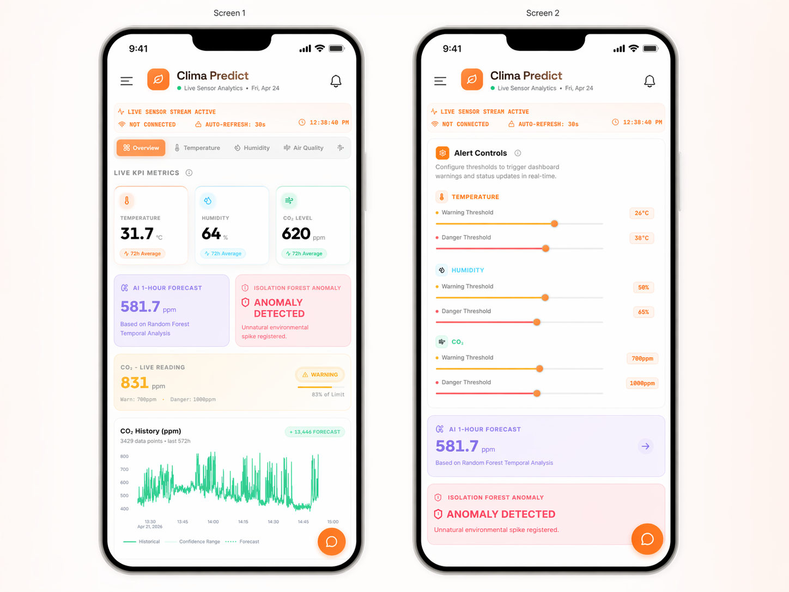
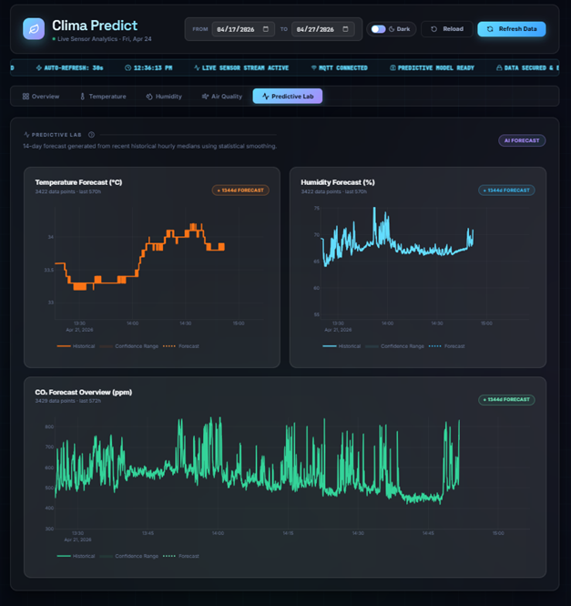
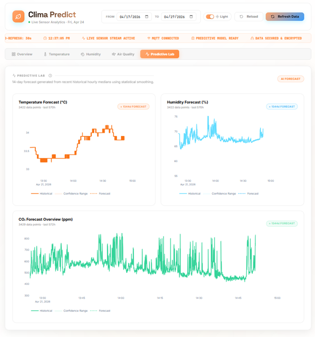
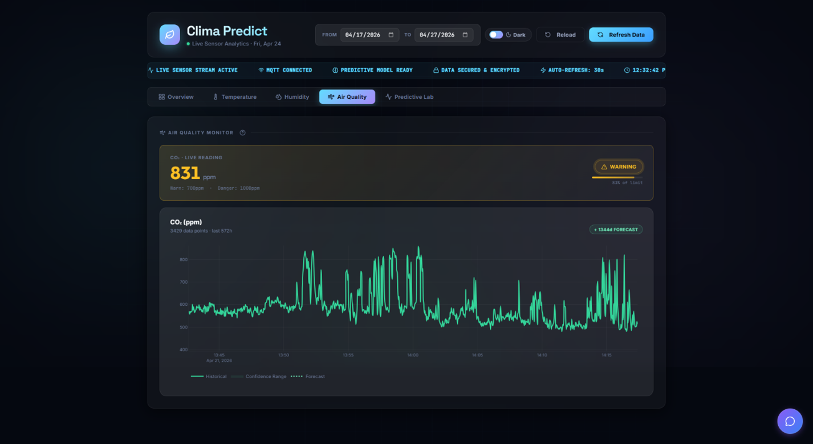
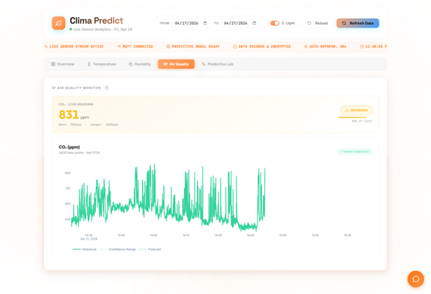
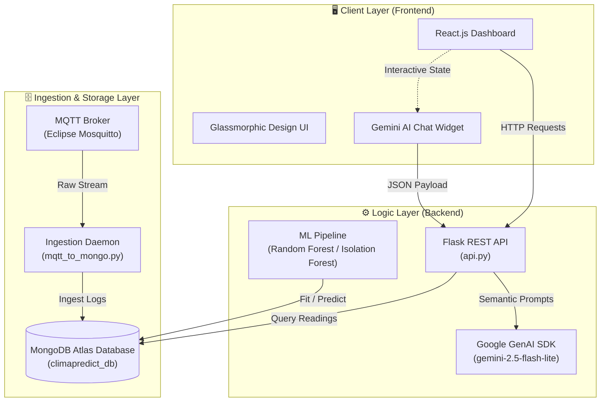

<div align="center">

<br/>

```text
╔═══════════════════════════════════════════════════════════╗
║   ██████╗██╗     ██╗███╗   ███╗ █████╗                   ║
║  ██╔════╝██║     ██║████╗ ████║██╔══██╗                  ║
║  ██║     ██║     ██║██╔████╔██║███████║                  ║
║  ██║     ██║     ██║██║╚██╔╝██║██╔══██║                  ║
║  ╚██████╗███████╗██║██║ ╚═╝ ██║██║  ██║                  ║
║   ╚═════╝╚══════╝╚═╝╚═╝     ╚═╝╚═╝  ╚═╝                  ║
║            P R E D I C T                                 ║
╚═══════════════════════════════════════════════════════════╝
```

### *Shifting environmental analytics from reactive telemetry to predictive science.*

<br/>


<br/>

[](https://react.dev/)
[](https://flask.palletsprojects.com/)
[](https://www.mongodb.com/)
[](https://python.org/)
[](https://deepmind.google/technologies/gemini/)
[](https://mqtt.org/)

</div>

---

## ⚡ What is ClimaPredict?

> **ClimaPredict** is an explainable, predictive environmental analytics platform. It changes indoor climate tracking from a historical logging chore into an **anticipatory intelligence hub**.

Instead of warning you *after* a room becomes stuffy or overheated, ClimaPredict ingests live IoT data streams, runs them through locally trained machine learning models, and forecasts environmental spikes before they happen—allowing operators to act proactively.

Designed with a premium glassmorphic UI and backed by the Google Gemini API, ClimaPredict brings real-time forecasting, smart anomaly detection, and semantic data analysis together under one cohesive platform.

---

## 📸 Interface Showcase

Explore the ClimaPredict interface across different panels and themes:

<details open>
<summary><b>🖥️ Main Overview Dashboard</b></summary>
<br/>

The central telemetry interface showing real-time temperature, humidity, and CO₂ statistics with live gauges:

| 🌙 Dark Mode | 📱 Mobile View |
|:---:|:---:|
|  |  |

</details>

<details>
<summary><b>🔮 Predictive Lab Forecasts</b></summary>
<br/>

The machine learning interface showcasing historical sensor trends alongside projected 1-hour forecasts:

| 🌙 Dark Mode | ☀️ Light Mode |
|:---:|:---:|
|  |  |

</details>

<details>
<summary><b>🍃 Air Quality Analytics</b></summary>
<br/>

Deep-dive air quality monitoring, graphing TVOC and eCO₂ concentrations over time:

| 🌙 Dark Mode | ☀️ Light Mode |
|:---:|:---:|
|  |  |

</details>

<details>
<summary><b>🧱 System Architecture Diagram</b></summary>
<br/>

A high-resolution system design overview:


</details>

---

## 🗺️ Architecture & Data Flow




---

## ✨ Features

<table>
  <tr>
    <td width="50%">
      <h3>🔴 Real-Time Stream Ingestion</h3>
      <p>High-frequency IoT sensor telemetry processing via the <b>MQTT Protocol</b> (Mosquitto). Sub-second updates for indoor temperature, humidity, and CO₂ concentration with resilient data buffering.</p>
    </td>
    <td width="50%">
      <h3>🔮 Machine Learning Forecasts</h3>
      <p>Custom trained Random Forest regression models analyze incoming patterns to predict 1-hour ahead CO₂ levels, alerting operators of impending air quality degradation before it happens.</p>
    </td>
  </tr>
  <tr>
    <td width="50%">
      <h3>🚨 Advanced Anomaly Detection</h3>
      <p>An automated Isolation Forest pipeline validates data streams on the fly, spotting and flagging sensor errors, sudden environmental spikes, or hazardous ventilation failures.</p>
    </td>
    <td width="50%">
      <h3>🤖 Semantic AI Assistant</h3>
      <p>An inline <b>Google Gemini</b> chat assistant. Ask natural-language questions like <i>"Why did carbon dioxide spike at 2:00 PM?"</i>, and it will analyze the MongoDB context to explain trends dynamically.</p>
    </td>
  </tr>
  <tr>
    <td width="50%">
      <h3>📊 Rich Data Visualization</h3>
      <p>Beautiful, responsive interactive charting that handles gaps using linear interpolation. Allows filtering by historical duration (hours/days) or specific calendar date ranges.</p>
    </td>
    <td width="50%">
      <h3>🎨 Premium Responsive Design</h3>
      <p>A stunning, glassmorphic UI styled with custom vanilla CSS. Switch smoothly between a dark cyberpunk dashboard and a clean, high-contrast light theme.</p>
    </td>
  </tr>
</table>

---

## 🛠️ Technology Stack

* **Frontend:** [React.js](https://react.dev/) + CSS (Glassmorphism & animations)
* **Backend:** [Python 3](https://python.org/) + [Flask](https://flask.palletsprojects.com/)
* **Database:** [MongoDB](https://www.mongodb.com/) (NoSQL time-series data storage)
* **IoT Protocols:** [MQTT](https://mqtt.org/) (Eclipse Mosquitto)
* **AI & Analytics:** [Google GenAI SDK](https://github.com/google/generative-ai-python) (Gemini 2.5 Flash Lite) + [Scikit-Learn](https://scikit-learn.org/) + [Joblib](https://joblib.readthedocs.io/)

---

## 📁 Repository Structure

```text
ClimaPredict/
├── 📂 assets/                   # Dashboard screenshots & architectural diagrams
│
├── 📂 frontend/
│   └── 📂 react-app/
│       ├── 📂 src/              # React components & dashboard layout
│       ├── 📂 public/           # Static assets (logos, icons)
│       └── package.json         # Node.js build configs & packages
│
├── 📂 Backend/
│   ├── api.py                   # Flask server, API endpoints & Gemini chat logic
│   ├── mqtt_to_mongo.py         # Subscribes to MQTT topic and saves data to DB
│   ├── train_ml_model.py        # Generates basic ML models for predictions
│   ├── advanced_ml.py           # Advanced Isolation Forest & Random Forest trainer
│   ├── ai_mqtt_worker.py        # Background MQTT pipeline with AI processing
│   ├── export_to_csv.py         # Utility to export database tables to CSV format
│   ├── .env                     # Local configuration keys (Ignored in Git)
│   └── *.pkl                    # Saved ML model binaries (Ignored in Git)
│
├── .gitignore                   # Safe files checklist
└── README.md                    # Creative project documentation
```

---

## 🔌 API Reference & Endpoints

All backend endpoints are routed through the Flask server (`http://localhost:5000`).

<details>
<summary><b>🔍 GET <code>/api/latest</code></b> — Fetch the latest telemetry & ML predictions</summary>

Returns the absolute newest sensor readings along with live anomaly flags and 1-hour future predictions.

**Response Schema:**
```json
{
  "status": "success",
  "data": {
    "server_timestamp": "2026-05-25T07:10:00.123Z",
    "dht22": {
      "temperature": 23.4,
      "humidity": 45.2
    },
    "ens160": {
      "eco2": 450,
      "tvoc": 12
    },
    "bmp280": {
      "pressure_hpa": 1012.3
    },
    "ml_insights": {
      "is_anomaly": false,
      "predicted_co2_1hr": 482.5
    }
  }
}
```
</details>

<details>
<summary><b>📈 GET <code>/api/history</code></b> — Retrieve historical time-series data</summary>

Returns a list of past sensor readings with linear interpolation applied to bridge any data gaps.

**Query Parameters:**
* `hours` *(optional, default: 24)*: Integer offset representing hours to fetch.
* `start` & `end` *(optional)*: ISO-8601 strings to query a specific calendar range.

**Response Schema:**
```json
{
  "status": "success",
  "count": 120,
  "data": [
    {
      "server_timestamp": "2026-05-25T06:00:00Z",
      "dht22": { "temperature": 22.8, "humidity": 46.1 },
      "ens160": { "eco2": 410 }
    }
  ]
}
```
</details>

<details>
<summary><b>💬 POST <code>/api/chat</code></b> — Interact with the Gemini AI Assistant</summary>

Query the integrated Gemini model about environmental states, context, or dashboard settings.

**Request Body:**
```json
{
  "message": "Why is the carbon dioxide level rising right now?",
  "history": [
    { "role": "user", "text": "Hello assistant" },
    { "role": "model", "text": "Hi! How can I help you analyze the sensor data?" }
  ],
  "dashboard_state": {
    "tab": "Overview",
    "lastReading": { "ens160": { "eco2": 820 } }
  }
}
```

**Response Schema:**
```json
{
  "status": "success",
  "reply": "Based on the recent telemetry log, the average CO2 level is 482 ppm, but your current dashboard shows a spike of 820 ppm. This could indicate localized ventilation issues or increased occupancy in the room."
}
```
</details>

---

## 🚀 Getting Started

### Prerequisites

* **Node.js** >= 18.x
* **Python** >= 3.10
* **MongoDB** >= 6.x (local or Atlas instance)
* **Mosquitto** (or any MQTT broker)

### Quick Setup

> [!TIP]
> Make sure your MQTT broker is active before running the ingestion pipeline!

#### 1. Ingestion & Server Setup
```bash
# Clone the repository
git clone https://github.com/Hansamalee0630/ClimaPredict.git
cd ClimaPredict

# Set up virtual environment
cd Backend
python -m venv .venv
source .venv/bin/activate  # On Windows: .venv\Scripts\activate
pip install -r requirements.txt
```

#### 2. Environment Variables
Create a file named [Backend/.env](file:///c:/Users/PC/OneDrive/Desktop/ClimaPredict/Backend/.env) and populate it with your local credentials:
```ini
MONGO_URI=mongodb://localhost:27017/
GEMINI_API_KEY=your_google_gemini_api_key
MQTT_BROKER=localhost
MQTT_PORT=1883
```

#### 3. Run Services
Start the databases and servers in separate terminal panes:

* **Pane A — Flask REST Server:**
  ```bash
  python api.py
  ```
* **Pane B — Ingestion Pipeline:**
  ```bash
  python mqtt_to_mongo.py
  ```
* **Pane C — React Dashboard:**
  ```bash
  cd ../frontend/react-app
  npm install
  npm start
  ```

---

## 🤝 Contributing

We welcome additions, fixes, and experimental models! Please follow these guidelines:

1. **Branch Naming:** Use `feat/` for new systems, `fix/` for bug repairs, and `chore/` for housekeeping.
2. **Commit Format:** Follow the [Conventional Commits](https://www.conventionalcommits.org/) standard.
3. **Open a PR:** Ensure your code runs cleanly and lint checks pass before merging.

---

## 📜 License

Distributed under the **MIT License**. See `LICENSE` for details.

---

<div align="center">

<br/>

*Built with precision. Engineered for foresight.*

**ClimaPredict** — making environments observable, explaining anomalies, and anticipating the future.

<br/>

⭐ **If this project helped you, give it a star on GitHub!** ⭐

</div>
