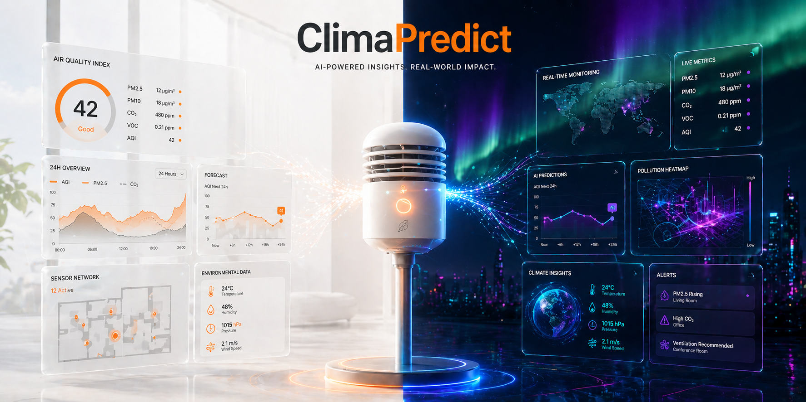

# ClimaPredict 🌍

An explainable, predictive environmental analytics platform that shifts indoor health monitoring from reactive data tracking to proactive intervention.

## 📖 Overview
ClimaPredict is a high-end, intelligent IoT dashboard designed to monitor, analyze, and forecast environmental conditions in real-time. By bridging live sensor data streams with advanced machine learning capabilities, ClimaPredict empowers users to maintain optimal environmental standards and make informed decisions based on data.

Built with an emphasis on modern UI/UX design, the platform features a highly interactive React-based frontend offering seamless light and dark mode experiences. At its core, it employs a robust Python/Flask backend and MongoDB for efficient data processing, ensuring accurate anomaly detection and predictive forecasting.

## ✨ Key Features
- **Real-Time Environmental Monitoring:** Seamless integration with IoT sensors via MQTT to track critical indoor climate metrics.
- **Predictive Lab Forecasts:** Utilizes historical data to generate predictive insights and forecasts, moving beyond simple reactive tracking.
- **Context-Aware AI Assistant:** Features an integrated Gemini AI chatbot providing intelligent insights, data interpretation, and UI guidance based on live sensor streams.
- **Anomaly Detection:** An automated backend pipeline to filter invalid sensor inputs and alert users to unusual environmental spikes (e.g., sudden CO2 increases).
- **Interactive Data Visualization:** Drill-down and drill-up capabilities allowing users to navigate hierarchical data easily. Includes advanced filtering by date and specific environmental metrics.
- **Modern, Dual-Theme UI/UX:** A stunning interface featuring a cyberpunk glassmorphism aesthetic with animated aurora backgrounds in dark mode, and a clean, brand-aligned professional light mode. 

## 🛠️ Technology Stack
- **Frontend:** React.js, modern CSS, dynamic micro-animations.
- **Backend:** Python, Flask API.
- **Database:** MongoDB (handling raw streams and anomaly filtering).
- **IoT Integration:** MQTT protocol.
- **AI/ML:** Google Gemini API for the intelligent chatbot and predictive analytics.
